arkdown

# Análise de Desempenho — WordPress com Nginx como Load Balancer

Experimento de testes de carga em uma aplicação WordPress containerizada com Docker, avaliando o impacto de escalar horizontalmente (1, 2 e 3 instâncias WordPress) sob diferentes cenários de carga e volumes de usuários simultâneos.

---

## Sumário

1. [Visão Geral da Arquitetura](#visão-geral-da-arquitetura)
2. [Metodologia dos Testes](#metodologia-dos-testes)
3. [Estrutura do Projeto](#estrutura-do-projeto)
4. [Como Executar](#como-executar)
5. [Resultados e Análise dos Gráficos](#resultados-e-análise-dos-gráficos)
   - [A — Tempo de Resposta vs Usuários](#a--tempo-de-resposta-vs-usuários)
   - [B — Tempo de Resposta vs Instâncias](#b--tempo-de-resposta-vs-instâncias)
   - [C — Requisições por Segundo vs Usuários](#c--requisições-por-segundo-vs-usuários)
   - [D — RPS vs Instâncias](#d--rps-vs-instâncias)
   - [E — Taxa de Falhas vs Usuários](#e--taxa-de-falhas-vs-usuários)
6. [Discussão: O Paradoxo das Múltiplas Instâncias](#discussão-o-paradoxo-das-múltiplas-instâncias)
7. [Conclusões](#conclusões)

---

## Visão Geral da Arquitetura

```
                         ┌─────────────┐
        Internet  ──────▶│    Nginx     │  (porta 80)
                         │ Load Balancer│
                         └──────┬──────┘
                    Round-Robin │
          ┌──────────┬──────────┤
          ▼          ▼          ▼
    ┌──────────┐ ┌──────────┐ ┌──────────┐
    │WordPress1│ │WordPress2│ │WordPress3│
    │  Apache  │ │  Apache  │ │  Apache  │
    └────┬─────┘ └────┬─────┘ └────┬─────┘
         │             │             │
         └─────────────┼─────────────┘
                       ▼
                 ┌───────────┐
                 │  MySQL 5.7 │  (único, compartilhado)
                 └───────────┘

     Volume compartilhado: ./html ──▶ todos os WordPress
```

Todos os serviços rodam via **Docker Compose** na mesma máquina. O Nginx recebe todas as requisições e as distribui em round-robin para as instâncias WordPress ativas. Todas as instâncias compartilham o mesmo banco de dados MySQL e o mesmo volume de arquivos (`./html`).

### Configuração do Apache (MPM Prefork — por instância)

| Parâmetro | Valor |
|-----------|-------|
| `StartServers` | 5 |
| `MinSpareServers` | 5 |
| `MaxSpareServers` | 20 |
| `MaxRequestWorkers` | 200 |
| `MaxConnectionsPerChild` | 500 |

### Configuração do Nginx

| Parâmetro | Valor |
|-----------|-------|
| `worker_processes` | auto |
| `worker_connections` | 4096 |
| `proxy_connect_timeout` | 10s |
| `proxy_read_timeout` | 60s |
| `keepalive` (upstream) | 64 conexões |
| Balanceamento | Round-robin (padrão) |

---

## Metodologia dos Testes

### Ferramenta

Os testes foram realizados com **Locust**, executado dentro do próprio Docker Compose, atacando o Nginx como ponto de entrada (`http://nginx`).

### Cenários de Carga

| Cenário | Descrição | Endpoints acessados |
|---------|-----------|---------------------|
| **Leve** | Apenas texto | `/?p=1` (post de texto simples) |
| **Médio** | Texto + imagem 253 KB | `/?p=1`, `/?p=13`, arquivo JPEG (~253 KB) |
| **Alto** | Texto + imagem 253 KB + imagem 530 KB | `/?p=1`, `/?p=13`, `/?p=5`, JPEG 253 KB, PNG 530 KB |

### Variáveis do Experimento

| Variável | Valores testados |
|----------|-----------------|
| Usuários simultâneos | 100, 200, 350 |
| Instâncias WordPress | 1, 2, 3 |
| Duração de cada teste | 90 segundos |
| Intervalo entre testes | 60 segundos |

### Métricas Coletadas

Para cada combinação (cenário × carga × arquitetura) foram coletadas via CSV do Locust:
- **Tempo de resposta médio** — Average Response Time (ms)
- **Percentil 95 (P95)** — tempo abaixo do qual caem 95% das requisições (ms)
- **Throughput (RPS)** — requisições completadas por segundo
- **Taxa de falhas** — percentual de requisições com erro (timeout, 5xx, etc.)

---

## Estrutura do Projeto

```
.
├── docker-compose.yml          # Orquestração dos serviços
├── nginx.conf                  # Config ativa do Nginx (trocada antes de cada bateria)
├── nginx-1inst.conf            # Config Nginx → apenas wordpress1
├── nginx-2inst.conf            # Config Nginx → wordpress1 + wordpress2
├── nginx-3inst.conf            # Config Nginx → wordpress1 + wordpress2 + wordpress3
├── apache-tuning.conf          # Tuning do MPM Prefork (Apache)
├── locustfile_leve.py          # Cenário leve  — só texto
├── locustfile_medio.py         # Cenário médio — texto + imagem 253 KB
├── locustfile_alto.py          # Cenário alto  — texto + 2 imagens
├── rodar_testes.ps1            # Script PowerShell de automação dos testes
├── gerar_graficos.py           # Script Python para geração dos gráficos
├── html/                       # Volume compartilhado WordPress
├── resultados/                 # CSVs gerados pelo Locust
│   ├── 1inst/
│   ├── 2inst/
│   └── 3inst/
└── graficos/                   # Gráficos gerados (15 arquivos PNG)
```

---

## Como Executar

### Pré-requisitos

- Docker e Docker Compose instalados
- PowerShell (para o script de automação)
- Python 3 com `pandas` e `matplotlib` (para gerar os gráficos)

### 1. Subir o ambiente

```bash
# Copie a configuração de Nginx desejada
copy nginx-1inst.conf nginx.conf   # Windows
cp nginx-1inst.conf nginx.conf     # Linux/macOS

docker compose up -d
```

### 2. Rodar os testes

Edite `rodar_testes.ps1` e defina a arquitetura desejada:

```powershell
$ARQUITETURA = "1inst"   # "1inst", "2inst" ou "3inst"
```

Execute:

```powershell
.\rodar_testes.ps1
```

Os CSVs serão salvos em `./resultados/<arquitetura>/`.

### 3. Repetir para outras arquiteturas

```powershell
# Troque o nginx.conf e reinicie o nginx
copy nginx-2inst.conf nginx.conf
docker compose restart nginx

# Edite $ARQUITETURA = "2inst" no script e rode novamente
.\rodar_testes.ps1
```

### 4. Gerar os gráficos

```bash
pip install pandas matplotlib
python gerar_graficos.py
# Saída: ./graficos/ (15 arquivos PNG)
```

---

## Resultados e Análise dos Gráficos

> **Legenda de cores comum a todos os gráficos:**
> - 🔴 Vermelho = 1 Instância WordPress
> - 🟡 Amarelo/Laranja = 2 Instâncias WordPress
> - 🟢 Verde = 3 Instâncias WordPress
> - Linha sólida = Média | Linha tracejada = Percentil 95 (P95)

---

### A — Tempo de Resposta vs Usuários

Estes gráficos mostram como o **tempo de resposta** (média e P95) evolui conforme o número de usuários simultâneos aumenta de 100 para 350, para cada configuração de instâncias. O eixo X representa o número de usuários e o eixo Y o tempo em milissegundos.

---

#### A.1 — Cenário Leve (Texto Simples)

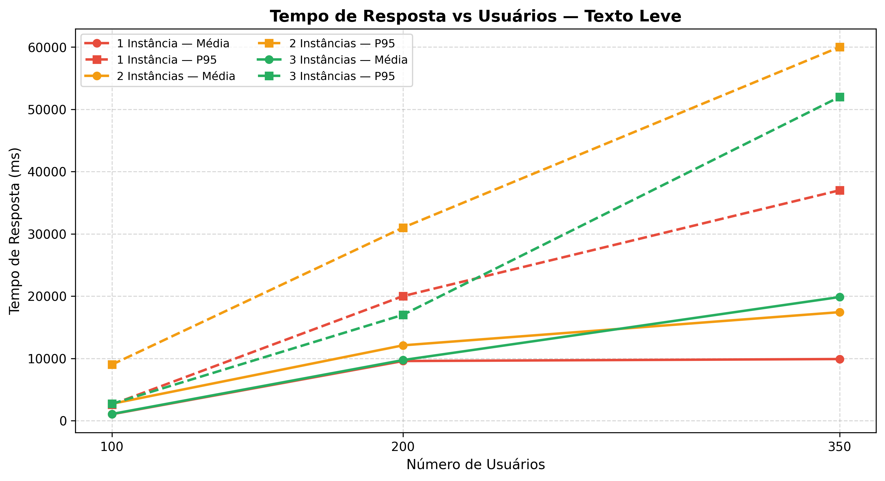

Com apenas requisições de texto (uma página simples), os tempos de resposta são os menores de toda a bateria, mas ainda assim revelam diferenças importantes entre as arquiteturas:

- **1 instância (vermelho):** apresenta o melhor desempenho consistente. A média cresce de forma suave (~1.000 ms com 100 usuários, ~10.000 ms com 350 usuários) e o P95 permanece em ~37.000 ms no pico — o menor entre as três configurações.
- **2 instâncias (amarelo):** começa com P95 mais alto já em 100 usuários (~9.400 ms) e cresce agressivamente. Em 350 usuários, o P95 chega a ~60.000 ms — quase o dobro do P95 de 1 instância.
- **3 instâncias (verde):** tem média razoável em 100 e 200 usuários, mas o P95 em 350 usuários (~52.000 ms) também ultrapassa o de 1 instância, com maior variância nas respostas.

**Conclusão do gráfico:** para carga leve, adicionar instâncias não traz benefício — ao contrário, a contenção no MySQL compartilhado já é suficiente para degradar o P95 das configurações com 2 e 3 instâncias.

---

#### A.2 — Cenário Médio (Imagem 253 KB)

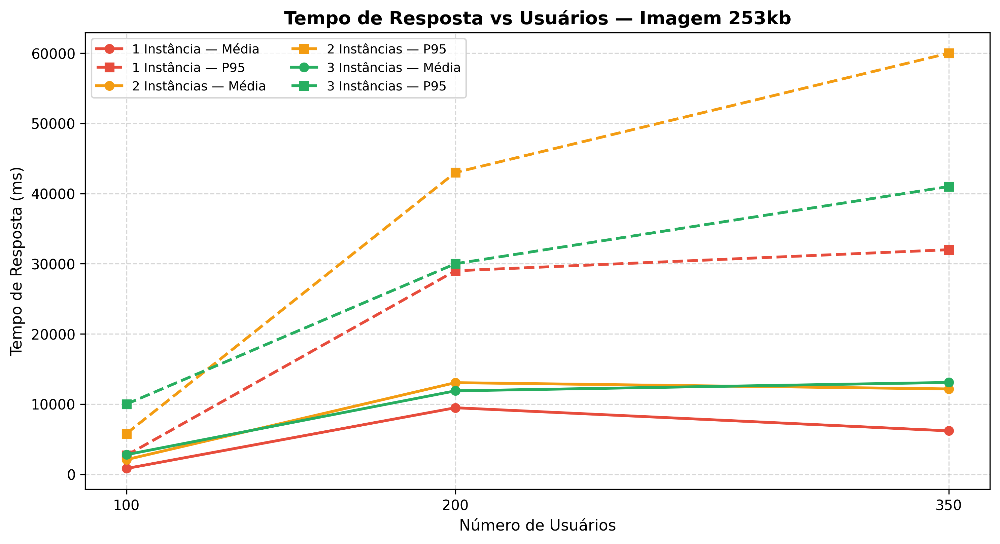

Com a introdução de uma imagem de ~253 KB, o volume de dados transferidos aumenta significativamente e o banco de dados recebe mais queries por pageview:

- **1 instância (vermelho):** novamente o melhor desempenho. A média cresce de ~1.000 ms (100 usuários) para ~9.500 ms (200 usuários) e surpreendentemente **cai para ~6.200 ms com 350 usuários** — resultado consistente com o sistema operando dentro de sua capacidade e sem contenção de recursos. O P95 estabiliza em torno de ~32.000 ms.
- **2 instâncias (amarelo):** apresenta a pior combinação neste cenário. O P95 já ultrapassa ~43.000 ms com 200 usuários e chega a **~60.000 ms com 350 usuários** — quase o dobro do P95 de 1 instância.
- **3 instâncias (verde):** a média (~12.500–13.000 ms em 200 e 350 usuários) fica próxima de 1 instância, porém o P95 permanece elevado (~30.000–41.000 ms), indicando alta variância: algumas requisições são atendidas bem, mas uma parcela significativa sofre longas esperas.

**Conclusão do gráfico:** 2 instâncias é a configuração com pior relação média/P95 neste cenário. 3 instâncias melhora a mediana mas mantém caudas longas de latência.

---

#### A.3 — Cenário Alto (Imagem 500 KB)

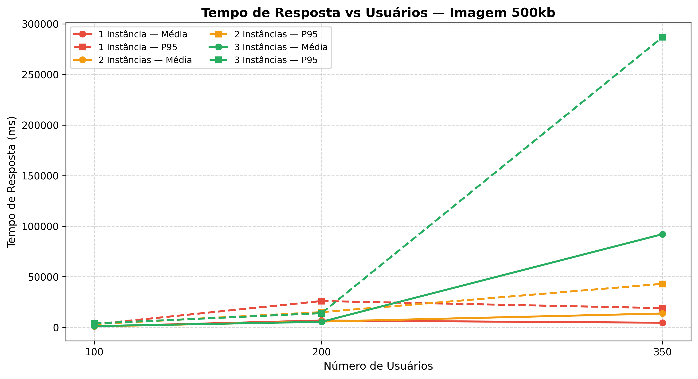

Este é o cenário mais exigente — combina três tipos de requisição (texto, imagem de 253 KB e imagem de 530 KB) e revela o colapso mais dramático de toda a bateria:

- **1 instância (vermelho):** desempenho notavelmente estável. A média fica em ~750 ms (100 usuários), ~4.200 ms (200 usuários) e **~4.700 ms com 350 usuários**. O P95 sobe de ~4.700 ms para ~18.000 ms — valores aceitáveis mesmo na maior carga.
- **2 instâncias (amarelo):** a média mantém-se próxima de 1 instância (~6.000–14.000 ms), mas o P95 cresce mais: ~24.000 ms em 200 usuários e **~42.000 ms em 350 usuários**.
- **3 instâncias (verde):** comportamento catastrófico na maior carga. A média explode para **~93.000 ms (93 segundos)** e o P95 atinge **~285.000 ms (quase 5 minutos)** com 350 usuários. Esses valores representam colapso completo do sistema sob a pressão combinada de I/O e contenção de banco.

**Conclusão do gráfico:** o cenário alto com 3 instâncias e 350 usuários representa o pior resultado de todo o experimento — o P95 de ~285 segundos é 15× maior que o P95 de 1 instância na mesma carga.

---

### B — Tempo de Resposta vs Instâncias

Estes gráficos invertem a perspectiva: o eixo X agora representa o **número de instâncias** (1, 2 ou 3) e cada linha representa um volume de usuários. Permitem observar diretamente o efeito de adicionar instâncias para uma carga fixa.

---

#### B.1 — Cenário Leve (Texto Simples)

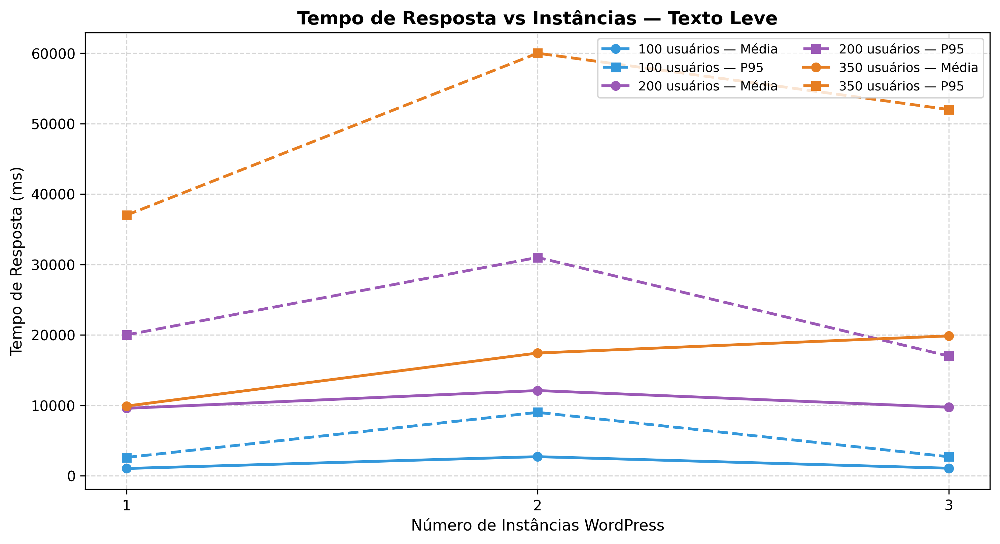

- **100 usuários (azul):** os tempos médios e P95 são próximos entre 1, 2 e 3 instâncias, com leve piora ao escalar. O sistema não está sob pressão.
- **200 usuários (roxo):** a média sobe levemente de 1 para 2 instâncias e se estabiliza em 3. O P95 apresenta um pico em 2 instâncias (~31.000 ms) com leve melhora em 3 (~17.000 ms) — sem benefício consistente de escalar.
- **350 usuários (laranja):** o P95 piora ao ir de 1 (~37.000 ms) para 2 instâncias (~60.000 ms), e melhora parcialmente em 3 (~52.000 ms) — ainda assim pior que 1 instância.

**Conclusão do gráfico:** nenhuma configuração com mais instâncias supera 1 instância para carga leve. O ponto de 2 instâncias é frequentemente o pior.

---

#### B.2 — Cenário Médio (Imagem 253 KB)

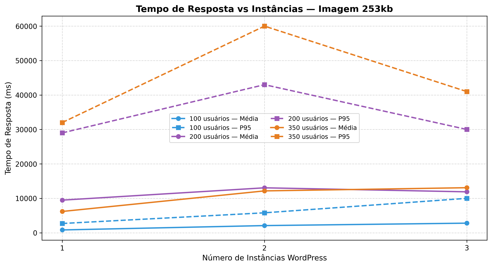

- **100 usuários (azul):** praticamente sem diferença entre 1, 2 e 3 instâncias na média. O P95 sobe ligeiramente ao escalar (~3.000 → 6.000 → 10.000 ms).
- **200 usuários (roxo):** a média é similar entre as três configurações (~10.000–13.000 ms), mas o P95 tem **pico acentuado em 2 instâncias** (~43.000 ms), caindo em 3 (~30.500 ms) — ainda acima de 1 instância (~29.000 ms).
- **350 usuários (laranja):** a média converge (~12.000–13.000 ms) entre as três configurações, mas o P95 sobe de ~32.000 ms (1 inst) para ~60.000 ms (2 inst) e recua para ~41.000 ms (3 inst).

**Conclusão do gráfico:** 2 instâncias é sistematicamente o pior ponto para P95 neste cenário. 3 instâncias melhora o P95 em relação a 2, mas nunca alcança 1 instância.

---

#### B.3 — Cenário Alto (Imagem 500 KB)

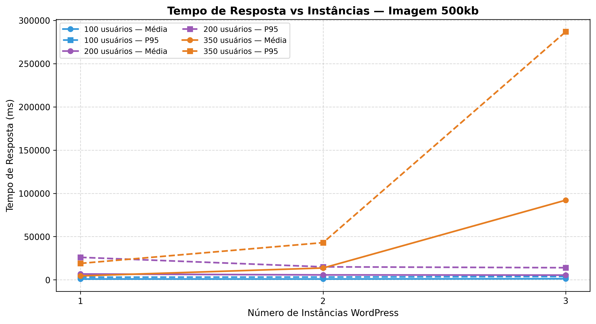

- **100 usuários (azul):** tempos estáveis e baixos nas três configurações (~750–2.000 ms de média). Praticamente indiferente ao número de instâncias.
- **200 usuários (roxo):** média estável (~13.000 ms) e P95 com pequena piora ao escalar (~14.000 → 14.000 → 14.500 ms). Ainda tolerável.
- **350 usuários (laranja):** o efeito mais dramático do experimento. A média cresce de **~19.000 ms (1 inst) → ~19.000 ms (2 inst) → ~93.000 ms (3 inst)** e o P95 de **~22.000 ms → ~44.000 ms → ~285.000 ms**. A adição da terceira instância nesta carga representa colapso completo.

**Conclusão do gráfico:** para a maior carga com conteúdo pesado, escalar de 2 para 3 instâncias multiplica o P95 por 6,5×. A contenção nos recursos compartilhados supera qualquer benefício de paralelismo.

---

### C — Requisições por Segundo vs Usuários

Estes gráficos mostram o **throughput efetivo** do sistema — quantas requisições são concluídas com sucesso por segundo. O eixo X é o número de usuários e cada linha representa uma configuração de instâncias. **Maior é melhor.**

---

#### C.1 — Cenário Leve (Texto Simples)

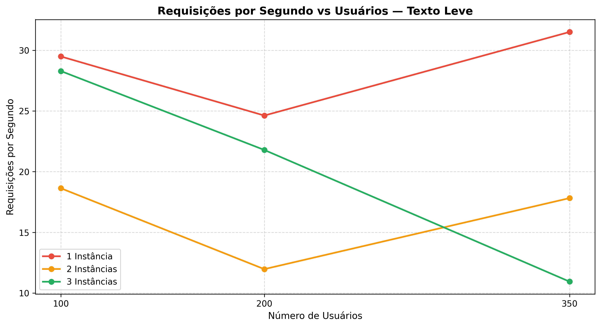

- **1 instância (vermelho):** RPS cresce de ~29,5 (100 usuários) → cai para ~24,5 (200 usuários) → sobe para **~31,5 RPS com 350 usuários**. A queda em 200 usuários e recuperação em 350 indicam que o Apache encontra seu ritmo ótimo sob alta concorrência.
- **2 instâncias (amarelo):** começa em ~18,7 RPS (100 usuários), **despenca para ~12 RPS com 200 usuários** — indicando saturação das conexões com MySQL — e recupera parcialmente para ~17,8 RPS em 350 usuários.
- **3 instâncias (verde):** inicia em ~28,5 RPS (100 usuários), cai para ~21,7 RPS (200 usuários) e continua caindo para **~11 RPS com 350 usuários** — queda de 61% do pico para a maior carga.

**Conclusão do gráfico:** 1 instância entrega o maior throughput em todas as cargas para o cenário leve. 2 e 3 instâncias apresentam quedas acentuadas de RPS com o aumento da carga.

---

#### C.2 — Cenário Médio (Imagem 253 KB)

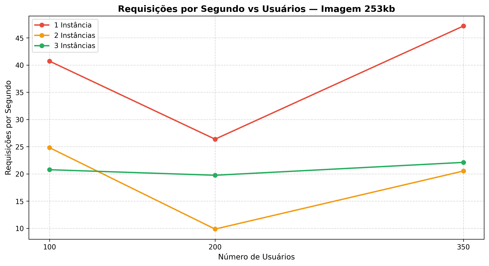

- **1 instância (vermelho):** mostra comportamento em "V" — parte em ~40,7 RPS, cai para ~26,4 RPS em 200 usuários (fase de saturação transitória) e **sobe para ~47 RPS com 350 usuários**. O sistema se adapta e aproveita melhor a concorrência alta.
- **2 instâncias (amarelo):** queda pronunciada de ~24,9 RPS (100 usuários) para **~10 RPS com 200 usuários** — pior ponto de todo o cenário médio — recuperando para ~20,6 RPS em 350 usuários.
- **3 instâncias (verde):** curva mais estável — ~20,8 → 19,9 → 22 RPS. Não colapsa, mas permanece sistematicamente abaixo de 1 instância.

**Conclusão do gráfico:** 1 instância apresenta o melhor throughput, especialmente em alta carga. 2 instâncias tem o pior ponto (10 RPS em 200 usuários). 3 instâncias é mais estável que 2, mas sem vantagem de throughput.

---

#### C.3 — Cenário Alto (Imagem 500 KB)

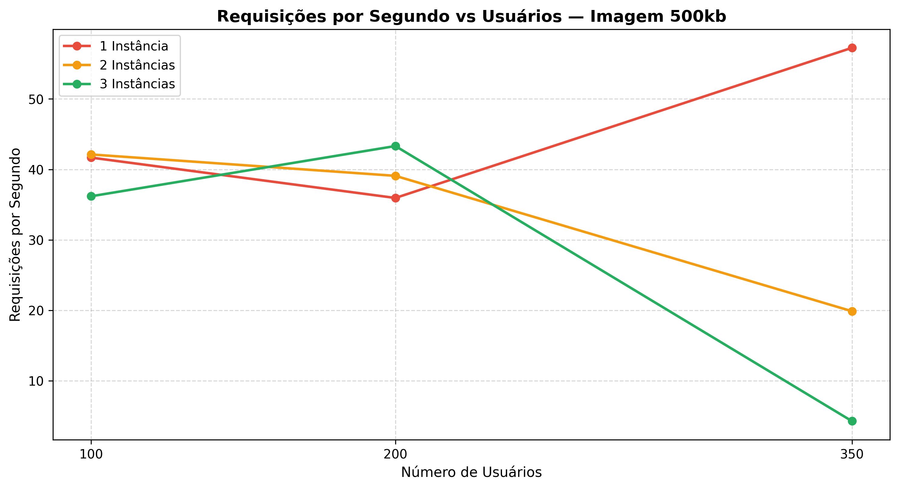

- **1 instância (vermelho):** crescimento consistente de throughput — ~41,5 → 36 → **57 RPS com 350 usuários**. O sistema lida bem com o conteúdo pesado quando não há contenção de banco.
- **2 instâncias (amarelo):** começa próximo de 1 instância (~42 RPS em 100 usuários), mantém-se em ~39 RPS em 200 usuários, mas **cai para ~20 RPS com 350 usuários** — 65% abaixo de 1 instância na maior carga.
- **3 instâncias (verde):** inicia em ~36,5 RPS (100 usuários), sobe ligeiramente para ~43,5 RPS (200 usuários) — o único ponto onde 3 instâncias supera as demais — mas **despenca para ~5 RPS com 350 usuários**, o pior throughput de toda a bateria.

**Conclusão do gráfico:** o contraste é extremo na maior carga: 1 instância entrega 57 RPS enquanto 3 instâncias entregam apenas 5 RPS — uma diferença de 11×. A queda de throughput das 3 instâncias é proporcional ao aumento de falhas e latência observados nos gráficos A e E.

---

### D — RPS vs Instâncias

Perspectiva complementar ao bloco C: o eixo X agora é o **número de instâncias** e cada linha representa um volume de usuários. Evidencia diretamente se adicionar instâncias melhora ou piora o throughput para uma carga fixa.

---

#### D.1 — Cenário Leve (Texto Simples)

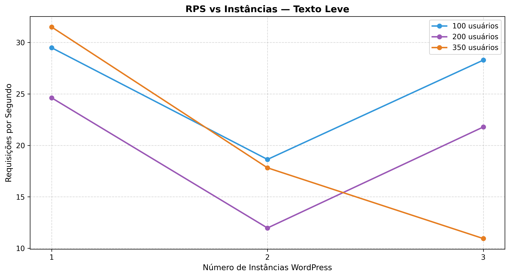

- **100 usuários (azul):** queda de ~29,5 → 18,8 → 28,7 RPS. As 2 instâncias têm throughput inferior, mas 3 instâncias se recupera parcialmente.
- **200 usuários (roxo):** queda de ~24,5 → 12 → 21,7 RPS. Padrão em "V" — 2 instâncias é o pior ponto.
- **350 usuários (laranja):** queda monotônica de ~31,5 → 17,8 → 11 RPS. Mais instâncias = menos throughput.

**Conclusão do gráfico:** para 350 usuários, cada instância adicionada reduz o RPS. Para cargas menores, o padrão é em "V" com 2 instâncias como pior ponto.

---

#### D.2 — Cenário Médio (Imagem 253 KB)

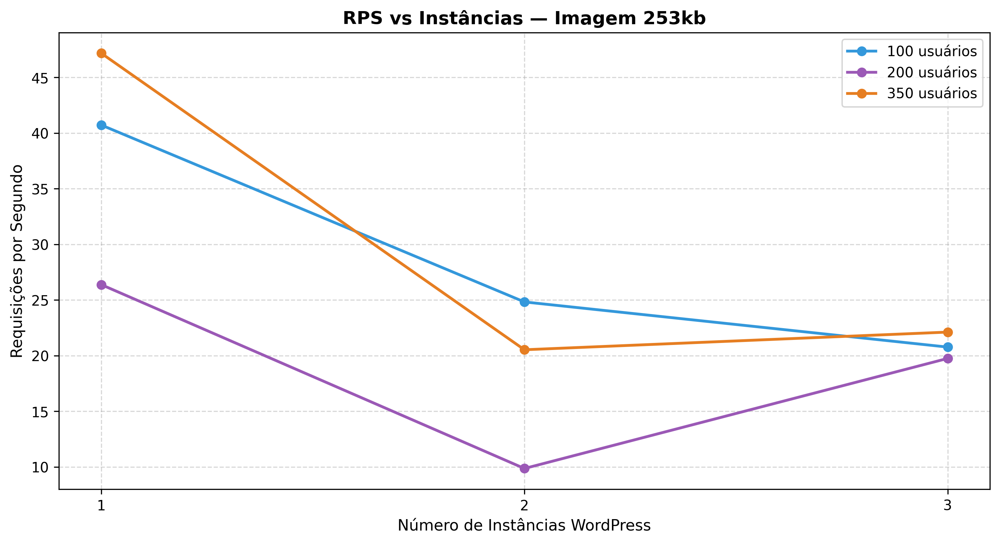

- **100 usuários (azul):** queda de ~40,7 → 30 → 25 RPS. Queda progressiva ao escalar.
- **200 usuários (roxo):** queda de ~26,4 → 10 → 19,9 RPS. Novamente o pior ponto em 2 instâncias.
- **350 usuários (laranja):** queda de ~47 → 20,6 → 22 RPS. 1 instância domina com folga; 2 e 3 instâncias têm throughput similar e muito menor.

**Conclusão do gráfico:** 1 instância entrega de 2× a 4× mais RPS que as configurações com múltiplas instâncias para o cenário médio em alta carga.

---

#### D.3 — Cenário Alto (Imagem 500 KB)

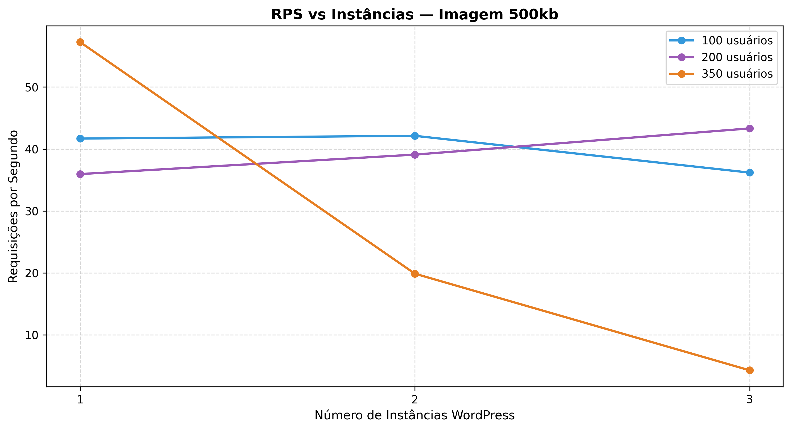

- **100 usuários (azul):** queda suave de ~41,5 → 42 → 36 RPS. Praticamente estável com leve piora em 3 instâncias.
- **200 usuários (roxo):** ligeiro aumento de ~36 → 39 RPS (1→2 inst), mas queda para ~43 RPS (3 inst — ligeiramente acima de 1 inst neste ponto).
- **350 usuários (laranja):** queda catastrófica — **57 → 20 → 5 RPS**. Para a maior carga, 3 instâncias entrega apenas 8,8% do throughput de 1 instância.

**Conclusão do gráfico:** o gráfico mais impactante do bloco D. A curva laranja de 350 usuários cai em colapso quase vertical entre 2 e 3 instâncias, confirmando que o sistema entra em colapso total com 3 instâncias sob alta carga pesada.

---

### E — Taxa de Falhas vs Usuários

Estes gráficos mostram a **porcentagem de requisições que resultaram em erro** (timeouts, HTTP 5xx, conexões recusadas, etc.). O eixo Y vai de 0% a 100%. **Menor é melhor.**

---

#### E.1 — Cenário Leve (Texto Simples)

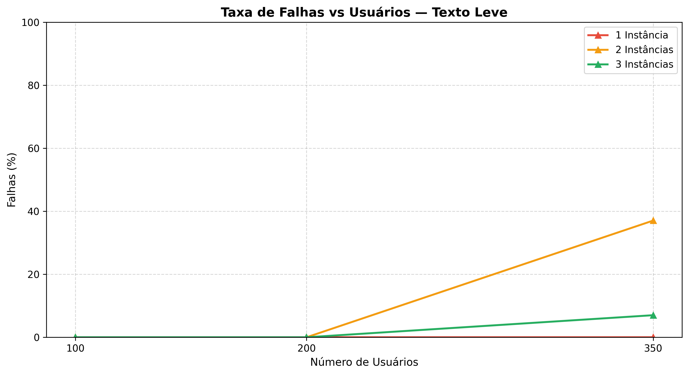

- **1 instância (vermelho):** falhas próximas de zero em todas as cargas. O sistema atende confortavelmente sem erros.
- **2 instâncias (amarelo):** falhas surgem apenas em 200 usuários (~0,5%) mas crescem aceleradamente para **~37% com 350 usuários** — o pior resultado de todo o cenário leve. Quase 4 em cada 10 requisições falham.
- **3 instâncias (verde):** falha ~1% em 100 usuários e mantém-se baixa até 200 usuários, subindo para **~7% com 350 usuários**. Melhor que 2 instâncias, mas ainda muito acima de 1 instância.

**Conclusão do gráfico:** surpreendente que o cenário mais simples (texto) apresente alta taxa de falhas com 2 instâncias em alta carga. Isso indica que a contenção no MySQL é agravada mesmo por queries simples quando executadas em grande volume por múltiplas instâncias simultâneas.

---

#### E.2 — Cenário Médio (Imagem 253 KB)

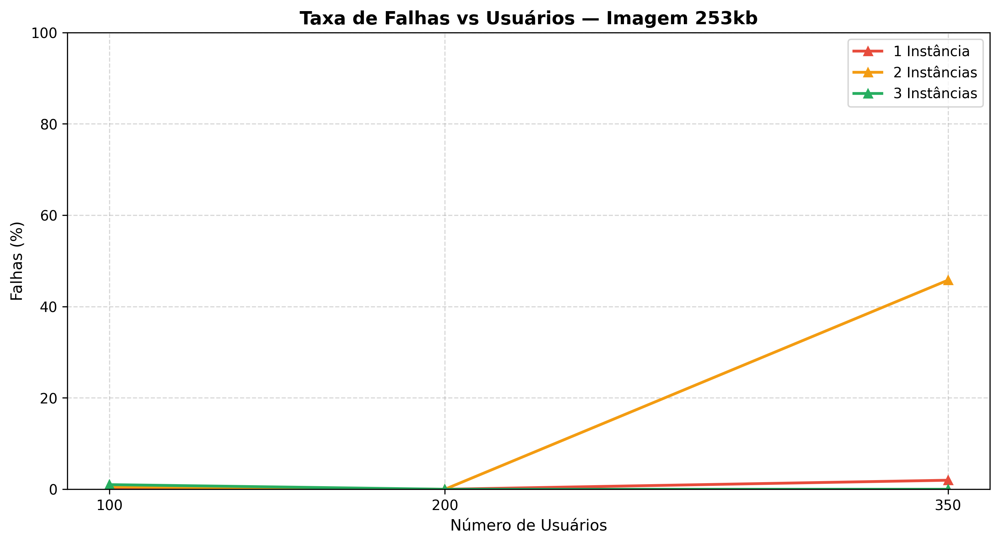

- **1 instância (vermelho):** taxa de falhas inferior a 2% em qualquer carga — desempenho excelente de confiabilidade.
- **2 instâncias (amarelo):** o comportamento mais crítico de toda a bateria. A taxa de falhas cresce de ~1% (100 usuários) para **~19% (200 usuários)** e atinge **~46% com 350 usuários** — quase metade de todas as requisições falhando. Isso explica os P95 altíssimos observados no gráfico A: a maioria das requisições bem-sucedidas espera pela liberação de conexões do banco enquanto outras falham por timeout.
- **3 instâncias (verde):** menos de 1% de falhas em qualquer carga. As requisições chegam com sucesso, porém com altíssima latência (conforme visto nos gráficos A e B) — o sistema aceita as conexões mas as processa muito lentamente.

**Conclusão do gráfico:** 2 instâncias apresenta uma característica de falha "rápida" (erros explícitos), enquanto 3 instâncias falha "silenciosamente" (sem erros, mas com latências absurdas). Ambos os padrões são problemáticos em produção.

---

#### E.3 — Cenário Alto (Imagem 500 KB)

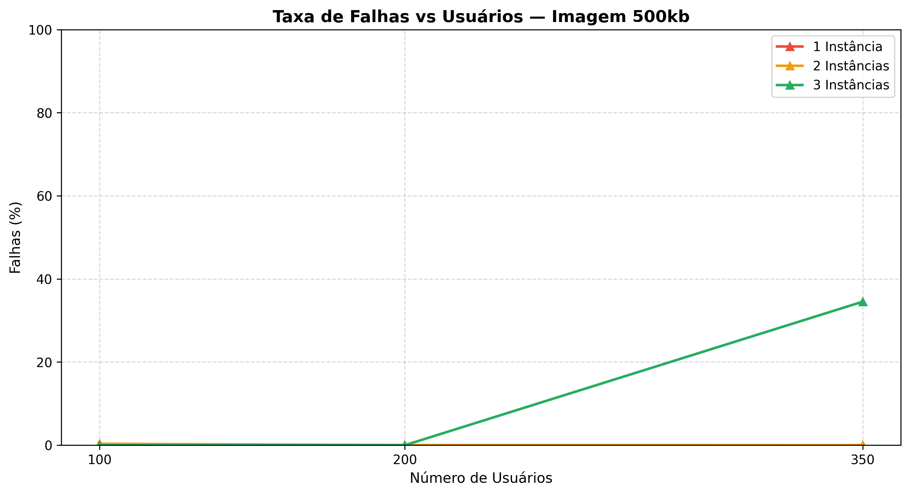

- **1 instância (vermelho):** falhas mínimas em todas as cargas (< 1%). O sistema é robusto mesmo com conteúdo pesado desde que não haja contenção de recursos.
- **2 instâncias (amarelo):** mantém falhas muito baixas (< 1%) em todas as cargas. Curiosamente, neste cenário específico, 2 instâncias tem boa confiabilidade — o problema com 2 instâncias no cenário alto não é taxa de falhas, mas sim throughput reduzido e P95 elevado.
- **3 instâncias (verde):** falhas surgem a partir de 200 usuários (~1%) e crescem para **~35% com 350 usuários**. O colapso de throughput observado no gráfico C (5 RPS) se explica aqui: 35% das requisições simplesmente falham.

**Conclusão do gráfico:** com 350 usuários e conteúdo pesado, 3 instâncias é a configuração mais instável. 1 instância mantém confiabilidade próxima de 100%. 2 instâncias mantém confiabilidade, mas paga o preço em throughput e latência.

---

## Discussão: O Paradoxo das Múltiplas Instâncias

O resultado central e contraintuitivo deste experimento é que **mais instâncias WordPress resultaram em pior desempenho** em todos os cenários avaliados. As causas estruturais são:

### 1. Gargalo no Banco de Dados Compartilhado

Todas as instâncias compartilham **um único MySQL**. O WordPress é altamente dependente de banco — cada pageview pode gerar dezenas de queries. Com 3 instâncias × 200 `MaxRequestWorkers` cada, o sistema pode tentar abrir até 600 conexões simultâneas ao MySQL, configurado com `max_connections=500`. Isso gera rejeição de conexões, contenção de locks e timeouts em cascata.

### 2. Contenção no Volume Compartilhado

O diretório `./html` é montado como volume em todas as instâncias simultaneamente. Em uma máquina local (não um sistema de arquivos distribuído), múltiplas instâncias acessando o mesmo volume geram gargalo de I/O, especialmente crítico ao servir arquivos grandes (imagens de 253–530 KB) sob alta concorrência.

### 3. Round-Robin Sem Considerar Estado das Instâncias

O Nginx distribui requisições igualmente entre instâncias sem levar em conta saturação, fila interna ou capacidade real de cada uma. Uma instância já sobrecarregada continua recebendo a mesma proporção de requisições que uma instância livre, amplificando a contenção.

### Síntese Comparativa

| Configuração | Melhor resultado | Pior resultado |
|---|---|---|
| **1 Instância** | Menor latência, maior RPS, menor taxa de falhas em todos os cenários | Single point of failure; sem redundância |
| **2 Instâncias** | Boa confiabilidade no cenário alto | Taxa de falhas crítica nos cenários leve e médio com alta carga (~37–46%) |
| **3 Instâncias** | Menor taxa de falhas no cenário alto (vs. 2 inst) | Piores latências e RPS; colapso total no cenário alto com 350 usuários (P95 ~285s, RPS ~5) |

---

## Conclusões

**1. A instância única domina este ambiente.** Para todas as combinações de cenário e carga testadas, 1 instância WordPress apresentou os menores tempos de resposta médios, os maiores RPS e as menores taxas de falha. Escalar horizontalmente sem resolver os gargalos subjacentes piora o sistema.

**2. O gargalo principal é o banco de dados compartilhado.** A degradação é proporcional à intensidade de uso do MySQL — mais instâncias geram mais conexões concorrentes, mais contenção de locks e mais timeouts em cascata.

**3. O volume compartilhado amplifica o problema com conteúdo pesado.** O colapso observado no cenário alto com 3 instâncias e 350 usuários (P95 ~285s, falhas ~35%, RPS ~5) é resultado da combinação de I/O compartilhado e contenção de banco sob demanda máxima.

**4. Os padrões de falha diferem entre 2 e 3 instâncias.** 2 instâncias tende a falhar "rapidamente" (erros explícitos, P95 alto por rejections). 3 instâncias tende a falhar "lentamente" (sem erros, mas latências absurdas) — ambos os padrões são igualmente problemáticos.

**5. O ponto de saturação dos recursos compartilhados está entre 100 e 200 usuários.** Com 100 usuários, as três configurações se comportam de forma relativamente próxima; a partir de 200 usuários, as diferenças se tornam severas.

**6. Para obter ganhos reais com múltiplas instâncias WordPress**, seriam necessárias mudanças arquiteturais como:**
- Réplicas de leitura MySQL ou connection pooling (ProxySQL / PgBouncer)
- Cache de objetos Redis/Memcached para reduzir a pressão no banco
- Armazenamento de objetos distribuído (S3, MinIO) em vez de volume local compartilhado
- Balanceamento com `least_conn` no Nginx em vez de round-robin puro

---

*Testes realizados com Locust · WordPress 5.4.2 / PHP 7.2 / Apache MPM Prefork · MySQL 5.7 (max_connections=500) · Nginx 1.19.0 · Docker Compose*