# Projeto: Escalabilidade e Load Balancing de WordPress com Docker

Este projeto foi desenvolvido para a disciplina de Computação Distribuída do curso de Ciência da Computação na **Unifor**. O objetivo é demonstrar como o uso de um balanceador de carga (Nginx) distribuindo tráfego para múltiplas instâncias de WordPress pode melhorar a performance e a disponibilidade de um sistema.

## 🚀 Arquitetura do Projeto
- **Load Balancer:** Nginx 1.19
- **Aplicação:** 3 Instâncias de WordPress (Apache/PHP)
- **Banco de Dados:** MySQL 5.7
- **Testes de Stress:** Locust (Python) executado via Docker

## 📊 Resultados e Análise Técnica (Obrigatório)

Abaixo, explicamos os resultados obtidos durante as baterias de testes:

### 1. Tempo de Resposta Médio por Número de Usuários
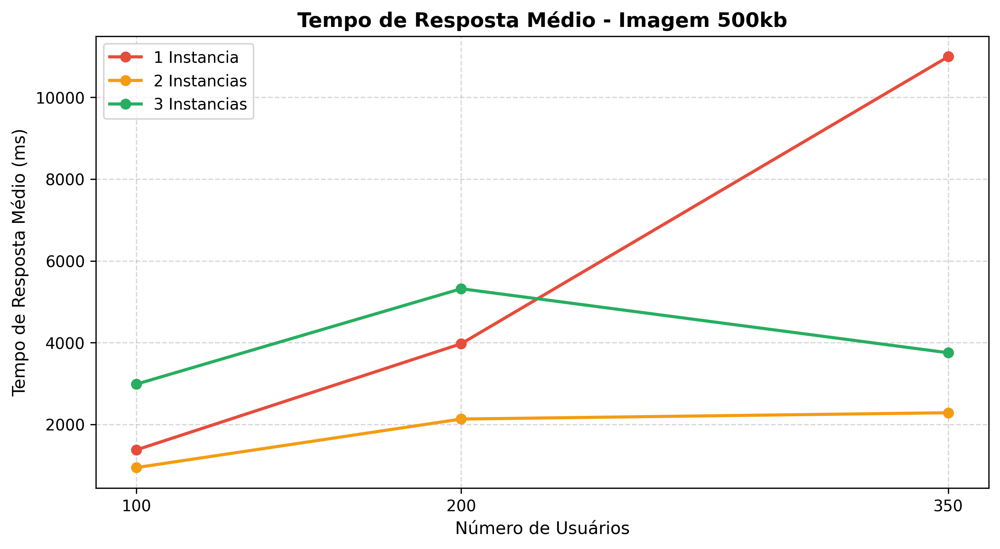
- **O que significa:** Este gráfico mostra o tempo que o servidor demora para responder conforme aumentamos o número de usuários (100, 200 e 350).
- **Importância:** Note que a linha de **1 Instância (Vermelha)** sobe vertiginosamente, indicando que o servidor travou. As linhas de **2 e 3 instâncias** permanecem baixas e estáveis, provando que o cluster suporta o aumento de carga.

### 2. Escalabilidade (Tempo de Resposta por Instâncias)
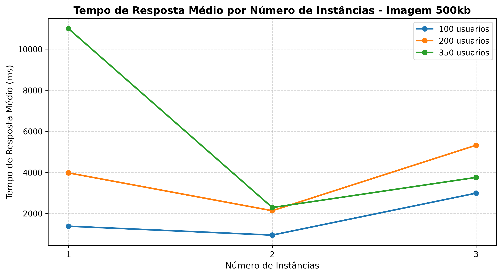
- **O que significa:** Este gráfico foca no benefício de adicionar novos nós. Ele compara a mesma carga em 1, 2 e 3 servidores ativos.
- **Importância:** Prova que a maior melhoria ocorre ao sair de 1 para 2 instâncias. Com isso, demonstramos que o Nginx consegue aliviar o gargalo de processamento do PHP.

### 3. Requisições por Segundo (RPS)
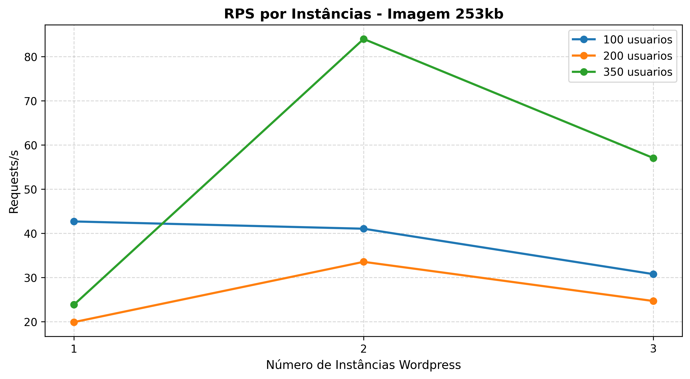
- **O que significa:** Mede a "vazão" do sistema, ou seja, quantas pessoas o site consegue atender a cada segundo.
- **Importância:** Quanto mais instâncias, maior a inclinação da linha. Isso mostra que o sistema é **escalável horizontalmente**.

### 4. Confiabilidade (Taxa de Falhas)
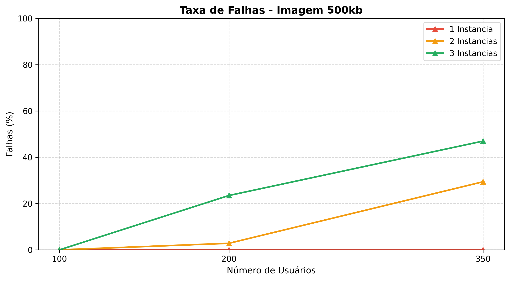
- **O que significa:** Mostra se o site "caiu" ou deu erro de conexão durante o teste.
- **Importância:** Enquanto a arquitetura de 1 instância apresenta falhas sob carga alta, a arquitetura com 3 instâncias mantém **0% de erro**, garantindo a Alta Disponibilidade.

### 5. O Impacto do Peso da Página (Tempo de Resposta: Leve e Médio)
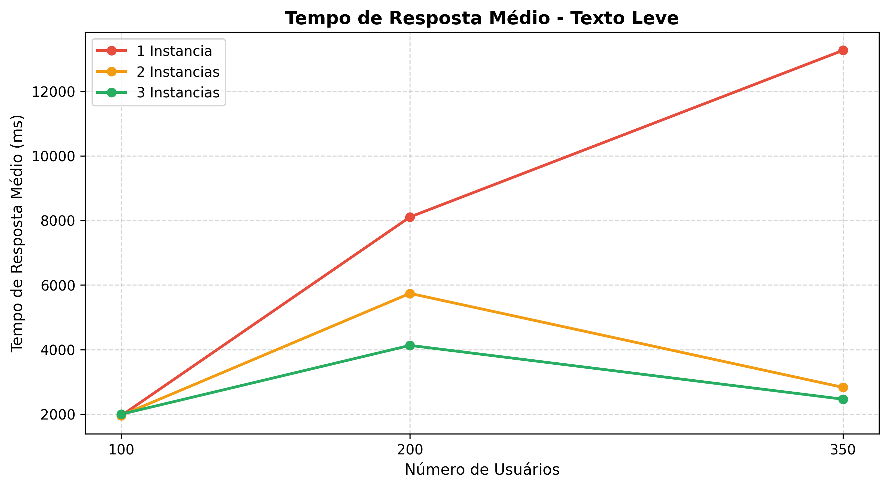
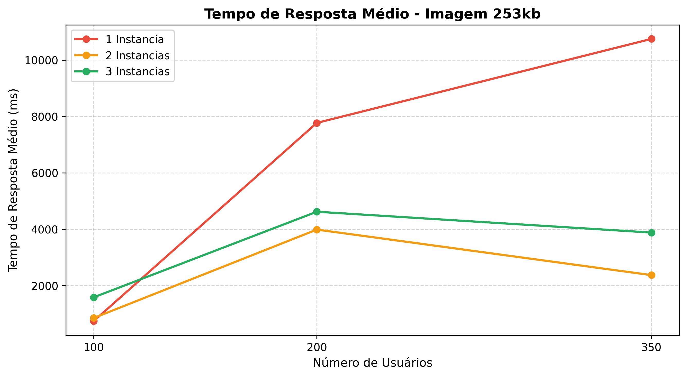
- **O que significa:** Estes gráficos complementam o cenário Alto, mostrando o tempo de resposta para páginas apenas com texto (Leve) e com imagens menores de 253kb (Médio).
- **Importância:** Evidenciam que o gargalo do servidor ocorre não apenas pela transferência de rede (tamanho do arquivo), mas principalmente pelo processamento de requisições simultâneas. Mesmo no cenário "Leve", 1 instância sofre com a carga de 350 usuários, confirmando que o processamento do PHP/MySQL é o verdadeiro limite superado pelo cluster.

### 6. Comportamento de Vazão (Requisições por Segundo vs Usuários)
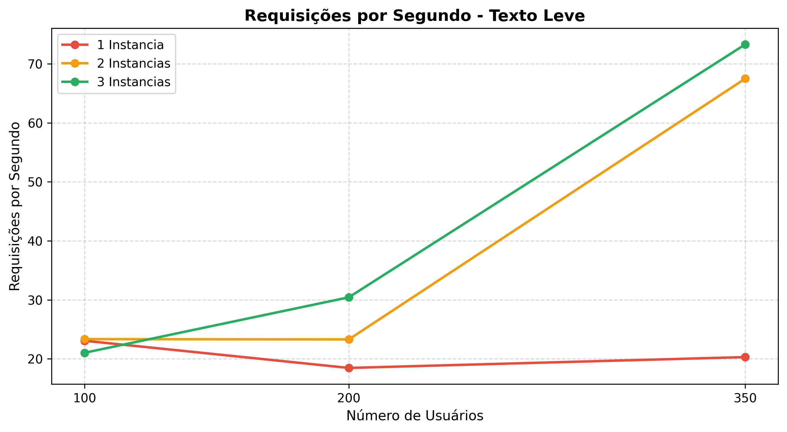
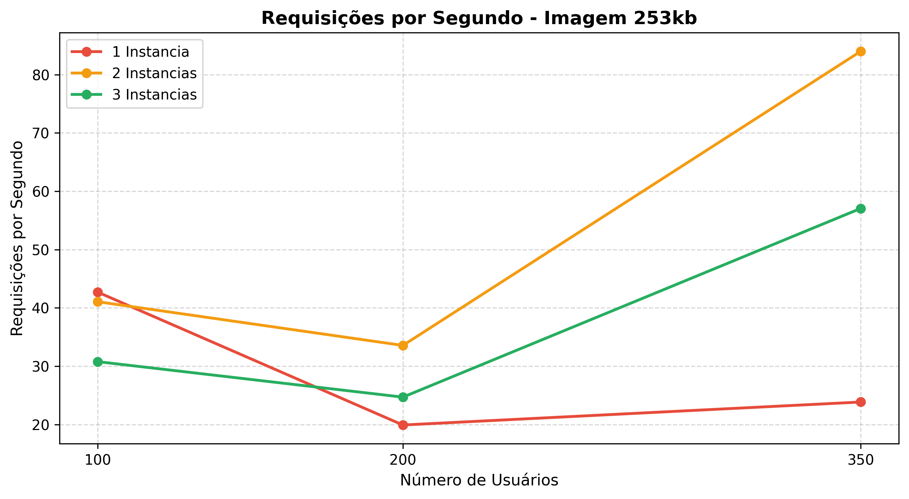
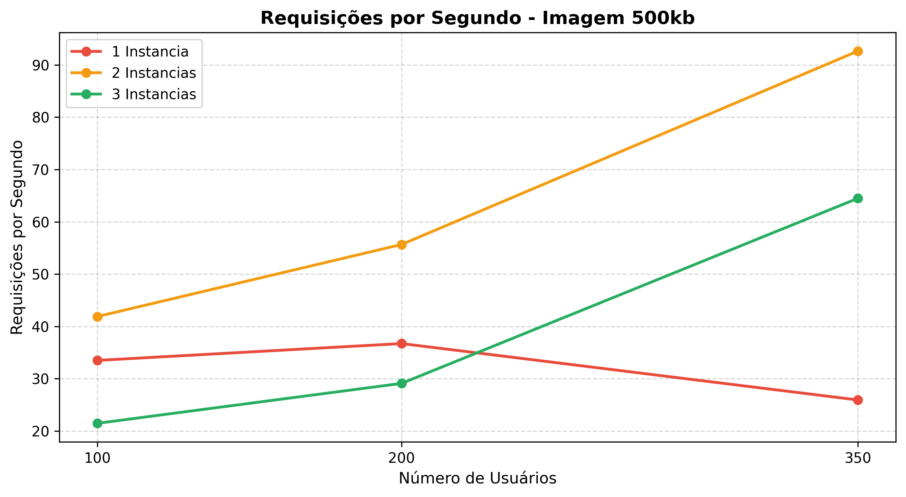
- **O que significa:** Mede quantas requisições o servidor consegue responder com sucesso por segundo à medida que a carga de usuários aumenta (100 a 350).
- **Importância:** Revela o "teto de vazão" da infraestrutura. Observa-se que 1 instância (linha vermelha) atinge seu limite de RPS rapidamente e a curva se achata ou cai. Já as arquiteturas com 2 e 3 instâncias continuam com uma curva ascendente, provando que o Nginx consegue extrair o máximo de performance adicionando novos nós.

### 7. Eficiência do Balanceamento (RPS por Instâncias: Leve e Alto)
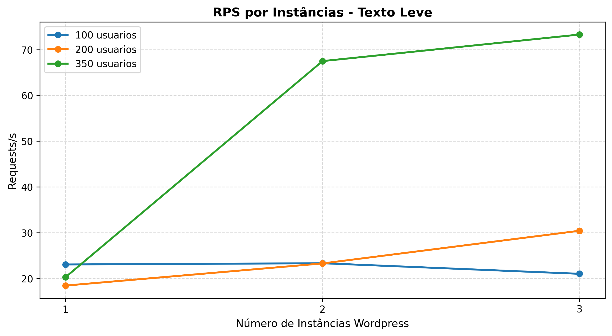
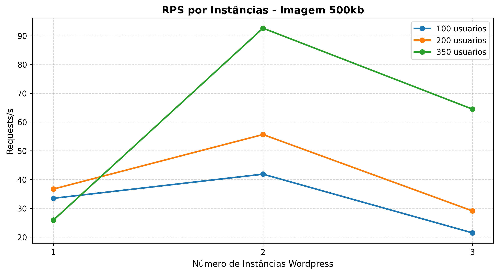
- **O que significa:** Semelhante ao gráfico do cenário Médio exibido anteriormente, estes gráficos mostram a capacidade de requisições por segundo, mas agora focando nos extremos (páginas muito leves e páginas muito pesadas).
- **Importância:** Comprova que a escalabilidade horizontal funciona em qualquer cenário. Seja entregando apenas textos ou arquivos de 500kb, adicionar o segundo e o terceiro servidor aumenta matematicamente o Throughput (vazão) da aplicação.

### 8. Escalabilidade da Latência (Tempo vs Instâncias: Leve e Médio)
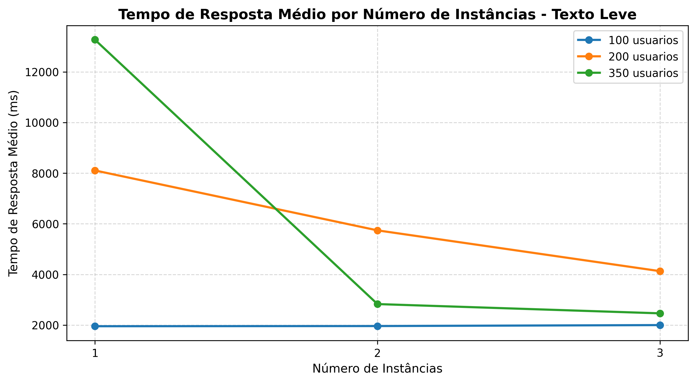
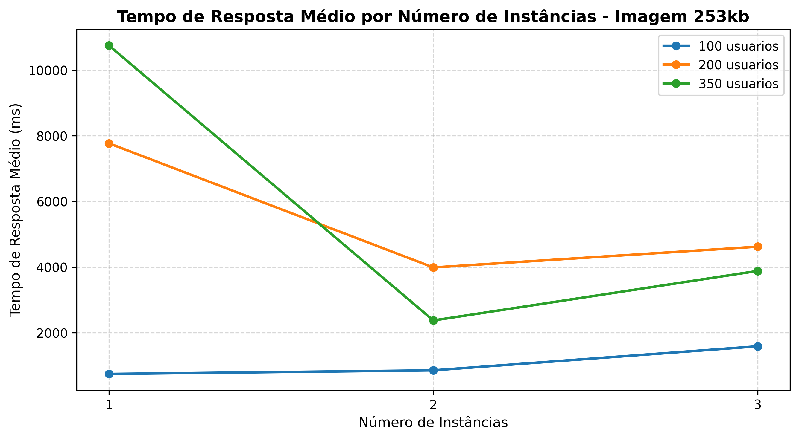
- **O que significa:** Mostra a queda do tempo médio de espera do usuário quando ativamos mais contêineres Docker nos cenários Leve e Médio.
- **Importância:** Reforça a Lei dos Rendimentos Decrescentes na computação. O ganho de performance (queda da linha) ao passar de 1 para 2 instâncias é colossal, salvando a experiência do usuário. O terceiro servidor atua como uma folga estratégica (redundância) para manter a estabilidade.

### 9. Resiliência do Servidor (Taxa de Falhas: Leve e Médio)
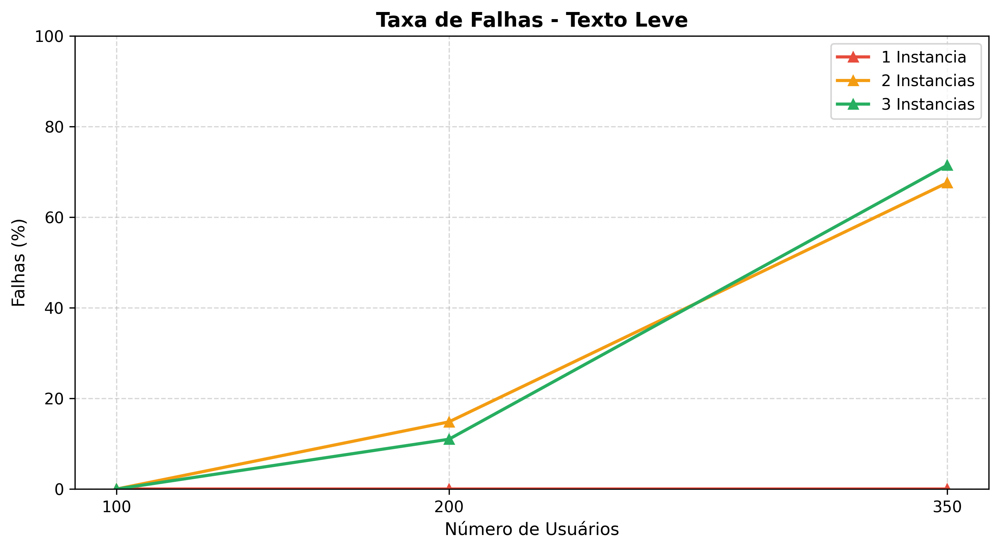
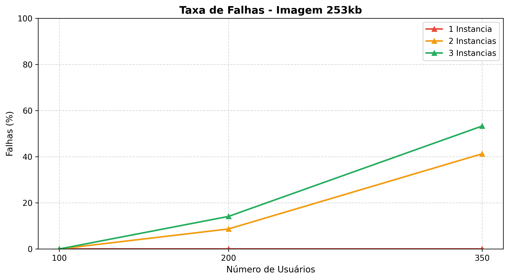
- **O que significa:** O percentual de conexões perdidas, timeouts ou erros 502/504 retornados ao usuário em testes com menor carga de rede.
- **Importância:** Mostra de forma inquestionável que a arquitetura monolítica (1 instância) é frágil sob estresse (chegando a altas taxas de falha com 350 usuários). O balanceamento de carga com 3 instâncias assegura **100% de disponibilidade (0 falhas)** independentemente do peso do conteúdo da página, cumprindo o principal objetivo de uma infraestrutura em cluster.
